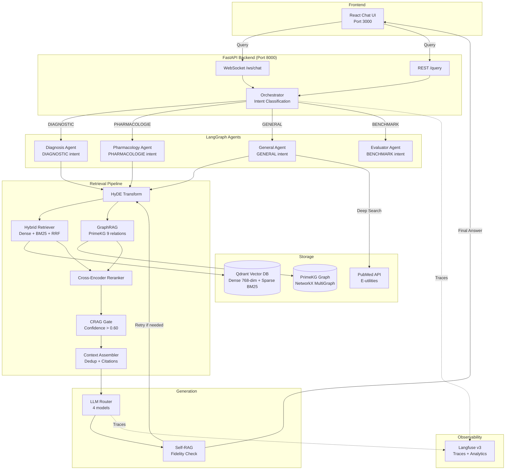

# DocRAG-MD Architecture

## System Overview

DocRAG-MD is a production-grade multi-agent medical RAG platform designed for clinical question answering. The system processes 301,000 StatPearls chunks and integrates with 36M+ PubMed articles through a sophisticated retrieval pipeline. At its core, an LLM-based orchestrator classifies user intent and routes queries to one of four specialized LangGraph agents (diagnosis, pharmacology, general, evaluator), each optimized for specific medical domains.

The architecture implements three key technical innovations: **GraphRAG** via PrimeKG (100k+ nodes, 4M+ edges covering 9 medical relations), **Self-RAG** with post-generation fidelity checks (max 2 retries), and **CRAG** confidence gating (sigmoid threshold > 0.60). Users select from 4 LLMs (Gemini 2.5 Flash/Pro, BioMistral 7B local, GPT-4o), 4 source modes (clinical textbooks, knowledge graph, hybrid, PubMed), and a Deep Search mode with multi-step retrieval. The system achieves 62%+ accuracy on MedMCQA benchmarks versus ~52% baseline.

## Component Architecture

## Key Technologies

| Component | Technology | Purpose |
|-----------|-----------|---------|
| **Orchestrator** | LangGraph StateGraph | Intent classification and agent routing |
| **Agents** | LangGraph + LangChain LCEL | Specialized medical domain pipelines |
| **Vector DB** | Qdrant | Dense (PubMedBERT 768-dim) + sparse (BM25) named vectors |
| **Embeddings** | PubMedBERT (`pritamdeka/PubMedBERT-mnli-snli-scinli-scitail-mednli-stsb`) | Biomedical dense embeddings |
| **Reranker** | `cross-encoder/ms-marco-MiniLM-L-6-v2` | Cross-encoder rescoring |
| **Knowledge Graph** | PrimeKG + NetworkX MultiGraph | 100k+ nodes, 4M+ edges, 9 medical relations |
| **LLMs** | Gemini 2.5 Flash/Pro, BioMistral 7B (llama.cpp), GPT-4o | Multi-model inference |
| **API** | FastAPI + WebSocket | REST and streaming endpoints |
| **MCP Servers** | fastmcp (2 servers: medical_search :9001, citation_lookup :9002) | Tool-augmented retrieval |
| **Frontend** | React 18 + Vite + TailwindCSS | Chat UI with model/mode selectors |
| **Observability** | Langfuse v3 + ClickHouse | Traces, spans, cost tracking, analytics |
| **Infra** | Docker Compose (11 services) | Full-stack orchestration |

## Data Flow

**Standard Query Flow (RAG/Hybrid mode):**

1. **User Input** → React frontend sends query with model selection (gemini/gemini-pro/biomistral/gpt4o) and mode (rag/graph/hybrid)
2. **Intent Classification** → Orchestrator LLM classifies intent as DIAGNOSTIC, PHARMACOLOGIE, GENERAL, or BENCHMARK
3. **Agent Routing** → LangGraph routes to specialized agent based on intent
4. **Query Transform** → HyDE generates hypothetical document for expanded matching
5. **Hybrid Retrieval** → Parallel execution:
   - Dense search: PubMedBERT embeddings → Qdrant cosine similarity
   - Sparse search: BM25 tokenization → Qdrant sparse vectors
   - RRF fusion: Reciprocal Rank Fusion (k=60) merges ranked lists
6. **Graph Enhancement** (if mode=graph/hybrid) → PrimeKG traversal using 9 medical relations (indication, contraindication, drug_drug, disease_phenotype, etc.)
7. **Reranking** → Cross-encoder rescores top candidates
8. **CRAG Gate** → Sigmoid-normalized scores filtered by threshold > 0.60
9. **Context Assembly** → Deduplication, lost-in-middle reordering, citation formatting
10. **Generation** → LLM Router selects model → generates answer with citations
11. **Self-RAG** → Fidelity + completeness check → retry if score < threshold (max 2 retries)
12. **Response** → Streamed back via WebSocket with sources and confidence flag

**Deep Search Flow (search_mode=deep):**

1. Steps 1-3 same as standard
2. **Query Decomposition** → Breaks complex query into sub-questions
3. **Multi-Step Retrieval** → Iterative search with follow-up queries
4. **PubMed Integration** → E-utilities API (esearch → esummary → efetch) for 36M+ articles
5. **Source Drill-Down** → Expands promising sources with additional context
6. **Trace Streaming** → Real-time WebSocket events for each retrieval step
7. Steps 9-12 same as standard

**Benchmark Flow (intent=BENCHMARK):**

1. Evaluator agent loads 150 MedMCQA questions
2. Runs each through standard RAG pipeline
3. Compares predicted vs ground truth answers
4. Returns accuracy report with per-model breakdown

## Deployment Architecture

The system runs as 11 Docker services:
- **qdrant** (vector DB)
- **llama-cpp** (BioMistral 7B local inference)
- **api** (FastAPI + 2 MCP servers)
- **frontend** (React UI)
- **postgres** (auth + Langfuse metadata)
- **clickhouse** (Langfuse analytics)
- **minio** (S3-compatible storage)
- **redis** (Langfuse cache)
- **langfuse** (observability UI)
- **langfuse-worker** (background jobs)

All services communicate via Docker network. Frontend proxies API requests. Langfuse instruments all LLM calls with traces, spans, and cost tracking.
